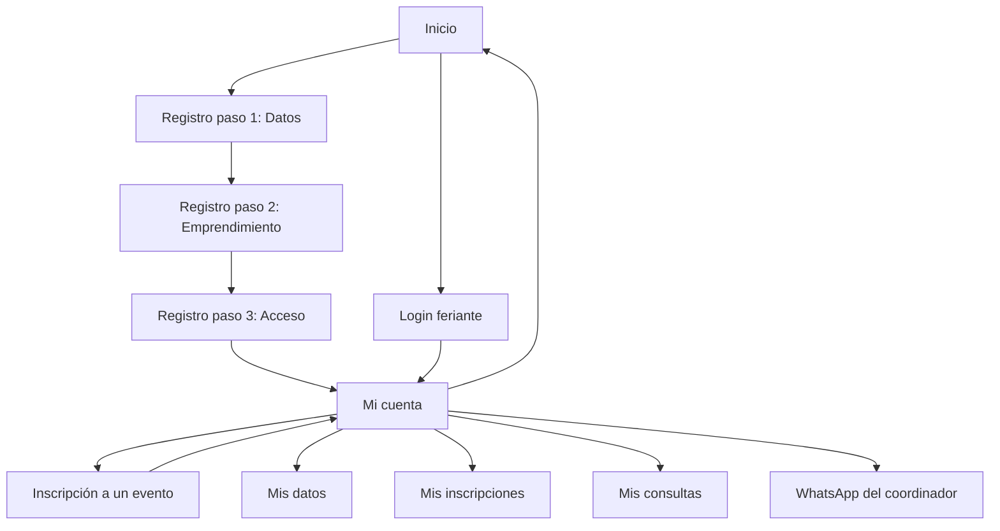
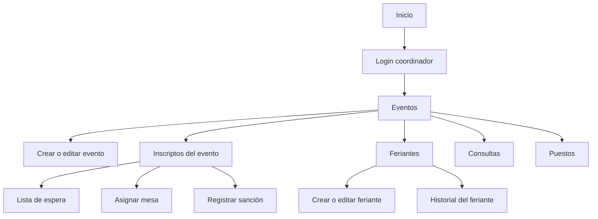
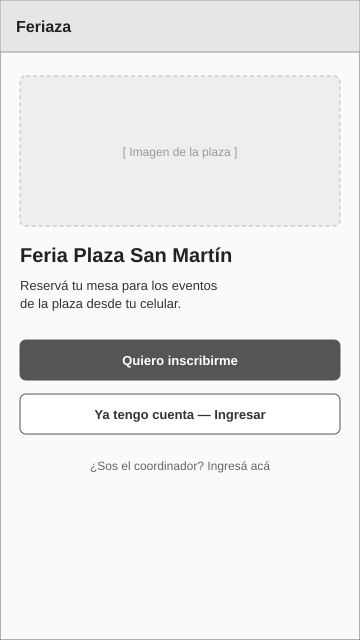
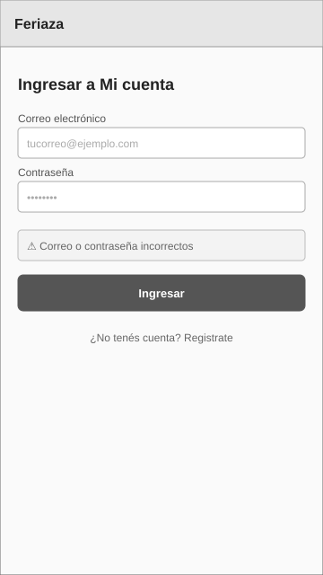
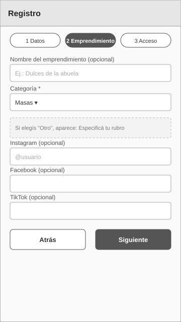
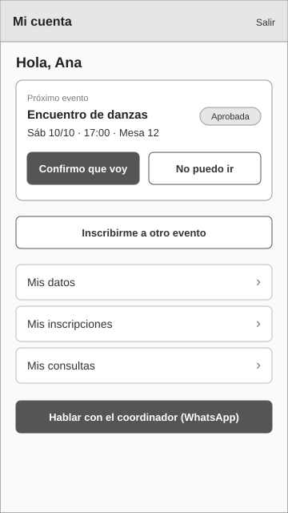
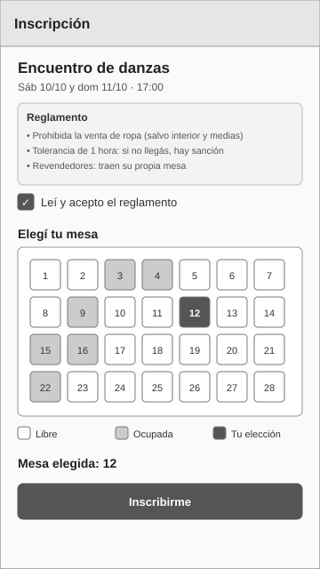
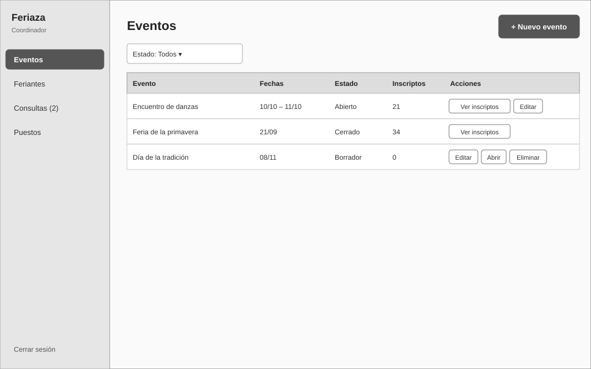
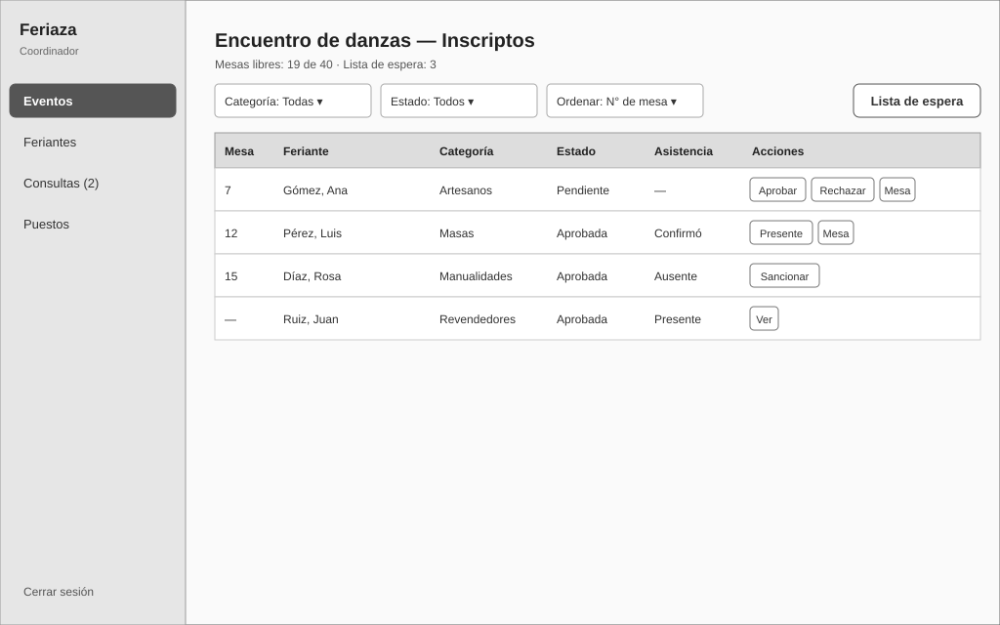

# Diseño de la interfaz

## 1. Principios de diseño

La interfaz está pensada para feriantes que usan principalmente el celular y que no siempre tienen experiencia con la tecnología. Cada principio se relaciona con un requerimiento no funcional de [requerimientos.md](requerimientos.md):

| Principio | Cómo se aplica | RNF |
|---|---|---|
| Primero el celular | Las pantallas del feriante se diseñan para 360 px de ancho y luego se adaptan a pantallas más grandes. | RNF-12 |
| Pocos pasos | Desde "Mi cuenta" hasta tener una mesa reservada hay como máximo 3 pantallas. | RNF-09 |
| Un objetivo por pantalla | Cada pantalla tiene una acción principal destacada. | RNF-08 |
| Lenguaje simple | Textos directos y sin tecnicismos ("Elegí tu mesa", "No puedo ir"). | RNF-10 |
| Errores que ayudan | Cada mensaje de error indica el campo y cómo corregirlo. | RNF-10 |
| Botones grandes | Botones de al menos 44 × 44 px y texto con buen contraste. | RNF-11 |
| Orientación | El registro muestra en qué paso está el usuario y permite volver atrás. | RNF-08 |

El panel del coordinador se diseña para computadora, porque se usa para gestionar listados, aunque también es adaptable al celular para marcar presentes el día del evento.

## 2. Mapa de navegación

### Visitante y feriante

### Coordinador

Desde cualquier pantalla del coordinador se puede ir a Eventos, Feriantes, Consultas y Puestos por el menú lateral, y cerrar sesión.

## 3. Pantallas

| Pantalla | Rol | RF | Wireframe |
|---|---|---|---|
| Inicio | Visitante | — | [01-inicio](img/wireframes/01-inicio.svg) |
| Login | Feriante, Coordinador | RF-03 | [02-login](img/wireframes/02-login.svg) |
| Registro (3 pasos) | Visitante | RF-01, RF-02 | [03-registro](img/wireframes/03-registro.svg) |
| Mi cuenta | Feriante | RF-04, RF-08, RF-16, RF-18 | [04-mi-cuenta](img/wireframes/04-mi-cuenta.svg) |
| Inscripción a un evento | Feriante | RF-06, RF-07 | [05-inscripcion](img/wireframes/05-inscripcion.svg) |
| Eventos | Coordinador | RF-05 | [06-coordinador-eventos](img/wireframes/06-coordinador-eventos.svg) |
| Inscriptos del evento | Coordinador | RF-09, RF-10, RF-11, RF-12, RF-18 | [07-coordinador-inscriptos](img/wireframes/07-coordinador-inscriptos.svg) |

Las pantallas de feriantes (listado, formulario e historial), consultas y puestos del coordinador siguen la misma estructura que "Eventos": menú lateral, título con botón de acción principal, filtros y tabla con acciones por fila.

## 4. Wireframes

Los wireframes son de baja fidelidad: muestran la estructura, el contenido y las acciones de cada pantalla, no los colores ni el estilo final.

### 4.1 Inicio

Punto de entrada. Las dos acciones principales son inscribirse o ingresar; el acceso del coordinador queda en segundo plano.

### 4.2 Login

La misma estructura sirve para el feriante y el coordinador, cada uno en su ruta. El error no indica si falló el correo o la contraseña.

### 4.3 Registro

Formulario en 3 pasos con indicador de progreso. Se muestra el paso 2; el paso 1 pide nombre, apellido y teléfono, y el paso 3 correo y contraseña. El campo "Especificá tu rubro" aparece solo si se elige la categoría "Otro".

### 4.4 Mi cuenta

Pantalla principal del feriante. Destaca el próximo evento con su mesa y estado, y permite confirmar o cancelar la asistencia con un solo toque.

### 4.5 Inscripción a un evento

El reglamento se acepta antes de elegir la mesa. El mapa muestra las mesas libres, ocupadas y la elegida. Para los revendedores, el mapa no se muestra.

### 4.6 Coordinador: eventos

Listado de eventos con su estado y cantidad de inscriptos. Las acciones cambian según el estado del evento.

### 4.7 Coordinador: inscriptos del evento

Reemplaza al cuaderno de registro. Permite filtrar, ordenar, aprobar, asignar mesa, marcar presentes y sancionar. Las acciones de cada fila dependen del estado de la inscripción.

