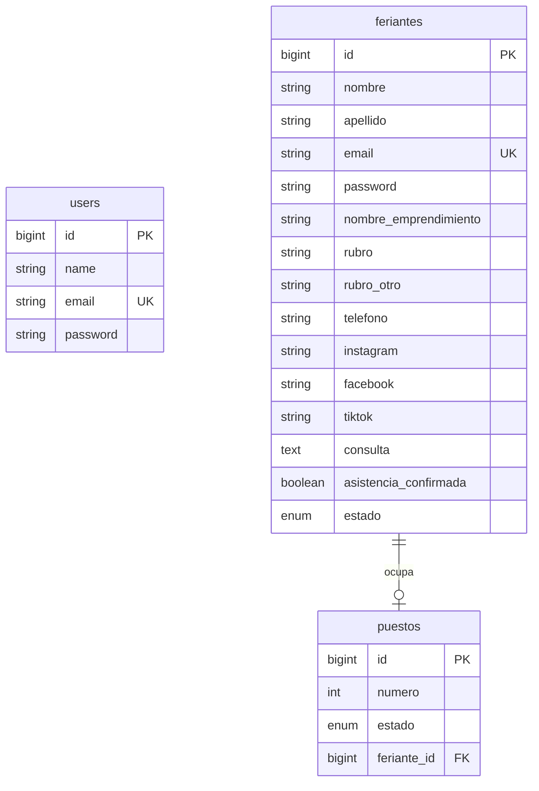
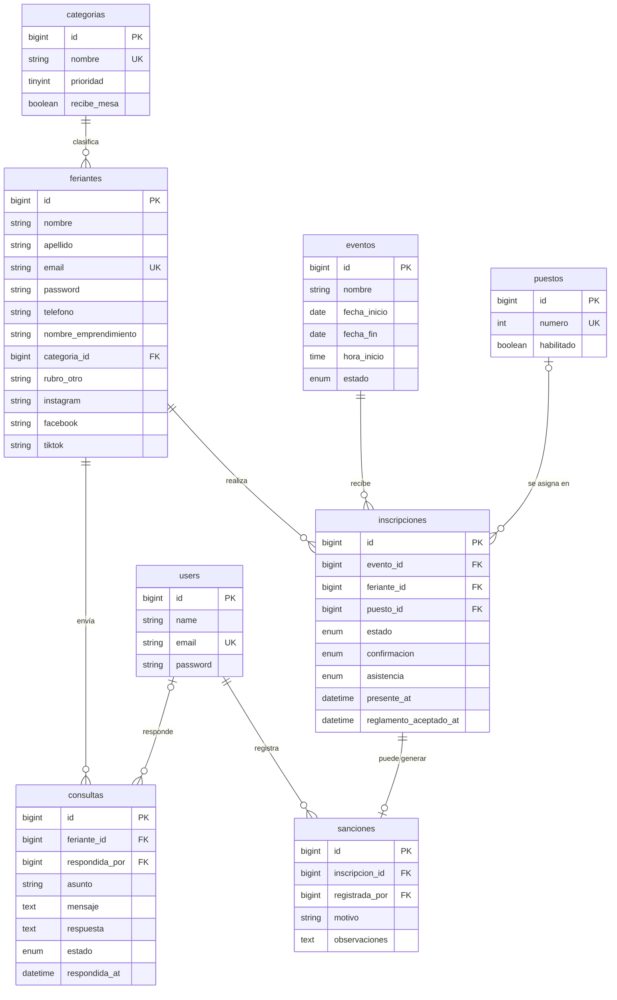

# Modelo de datos

Este documento describe el modelo implementado hasta el Sprint 2 y el modelo propuesto para cubrir todos los requerimientos de [requerimientos.md](requerimientos.md). Las decisiones de diseño asociadas están en [decisiones.md](decisiones.md) (D-03, D-06 y D-07).

## 1. Modelo actual (implementado)

El sistema actual tiene tres tablas. Los tipos se relevaron a partir de los modelos, las migraciones y las validaciones de los controladores.

**Limitaciones del modelo actual respecto de los requerimientos:**

- No existen **eventos**: cada feriante tiene un único puesto para siempre, cuando en la realidad la inscripción se hace por evento (D-01 del relevamiento).
- El **estado** (pendiente, aprobado, rechazado) y la **confirmación de asistencia** están en el feriante, cuando en realidad corresponden a cada participación en un evento.
- El **rubro** es un texto libre en la base; los valores permitidos solo se controlan en las validaciones de los controladores, y no guarda la prioridad ni la regla de si recibe mesa (RN-02, RN-03).
- La **consulta** es un solo campo de texto en el feriante: no permite varias consultas ni guardar la respuesta del coordinador.
- No hay registro de **presentes** ni de **sanciones**.

## 2. Modelo propuesto

### Normalización

El modelo propuesto está en tercera forma normal: cada dato se guarda una sola vez y depende solo de la clave de su tabla. En particular:

- La prioridad y la regla de mesa dependen de la **categoría**, no del feriante, por eso están en `categorias`.
- El estado de un puesto (libre u ocupado) **no se guarda**: se deduce de si existe una inscripción activa con ese puesto en el evento. Así no puede quedar desincronizado.
- La relación entre feriante, evento y puesto es la **inscripción**, que guarda todo lo que depende de esa participación concreta.

## 3. Diccionario de datos

Todas las tablas incluyen además `created_at` y `updated_at` (timestamps de Laravel), que no se repiten en cada tabla.

### users (coordinadores)

| Campo | Tipo | Obligatorio | Descripción y restricciones |
|---|---|:---:|---|
| id | bigint unsigned | Sí | Clave primaria autoincremental. |
| name | varchar(255) | Sí | Nombre del coordinador. |
| email | varchar(255) | Sí | Correo de acceso. Único. |
| password | varchar(255) | Sí | Contraseña con hash bcrypt (RNF-01). |
| remember_token | varchar(100) | No | Token de "recordarme" de Laravel. |

### categorias

| Campo | Tipo | Obligatorio | Descripción y restricciones |
|---|---|:---:|---|
| id | bigint unsigned | Sí | Clave primaria. |
| nombre | varchar(50) | Sí | Artesanos, Manualidades, Masas, Revendedores u Otro. Único. |
| prioridad | tinyint unsigned | Sí | 1 = alta, 2 = media, 3 = baja (RN-02). |
| recibe_mesa | boolean | Sí | `false` para Revendedores (RN-03). |

### feriantes

| Campo | Tipo | Obligatorio | Descripción y restricciones |
|---|---|:---:|---|
| id | bigint unsigned | Sí | Clave primaria. |
| nombre | varchar(100) | Sí | Nombre del feriante. |
| apellido | varchar(100) | Sí | Apellido del feriante. |
| email | varchar(255) | Sí | Correo de acceso. Único. |
| password | varchar(255) | Sí | Contraseña con hash bcrypt (RNF-01). |
| telefono | varchar(20) | Sí | Teléfono de contacto. |
| nombre_emprendimiento | varchar(150) | No | Nombre comercial. |
| categoria_id | bigint unsigned | Sí | FK a `categorias.id`. |
| rubro_otro | varchar(100) | No | Descripción del rubro cuando la categoría es "Otro". Obligatorio en ese caso. |
| instagram | varchar(100) | No | Usuario o enlace. |
| facebook | varchar(100) | No | Usuario o enlace. |
| tiktok | varchar(100) | No | Usuario o enlace. |
| remember_token | varchar(100) | No | Token de "recordarme" de Laravel. |

### eventos

| Campo | Tipo | Obligatorio | Descripción y restricciones |
|---|---|:---:|---|
| id | bigint unsigned | Sí | Clave primaria. |
| nombre | varchar(100) | Sí | Por ejemplo, "Encuentro de danzas". |
| fecha_inicio | date | Sí | Primer día del evento. |
| fecha_fin | date | Sí | Último día. Igual o posterior a `fecha_inicio`. |
| hora_inicio | time | Sí | Base para calcular la tolerancia de 1 hora (RN-07). |
| estado | enum('borrador','abierto','cerrado','cancelado') | Sí | Solo los eventos `abierto` admiten inscripciones. Valor inicial: `borrador`. |

### puestos

| Campo | Tipo | Obligatorio | Descripción y restricciones |
|---|---|:---:|---|
| id | bigint unsigned | Sí | Clave primaria. |
| numero | int unsigned | Sí | Número de mesa en el plano de la plaza. Único. |
| habilitado | boolean | Sí | Permite retirar una mesa del plano sin borrarla. Valor inicial: `true`. |

### inscripciones

| Campo | Tipo | Obligatorio | Descripción y restricciones |
|---|---|:---:|---|
| id | bigint unsigned | Sí | Clave primaria. |
| evento_id | bigint unsigned | Sí | FK a `eventos.id`. |
| feriante_id | bigint unsigned | Sí | FK a `feriantes.id`. Único junto con `evento_id` (un feriante se inscribe una vez por evento). |
| puesto_id | bigint unsigned | No | FK a `puestos.id`. Nulo para revendedores (RN-03). Único junto con `evento_id` (RN-09). |
| estado | enum('pendiente','aprobada','rechazada','cancelada') | Sí | Aprobación del coordinador. Valor inicial: `pendiente`. |
| confirmacion | enum('sin_confirmar','confirmada','no_asiste') | Sí | Respuesta del feriante (RF-08). Valor inicial: `sin_confirmar`. |
| asistencia | enum('pendiente','presente','ausente') | Sí | Control del día del evento (RF-11). Valor inicial: `pendiente`. |
| presente_at | datetime | No | Hora en que se marcó presente. |
| reglamento_aceptado_at | datetime | Sí | Fecha y hora de aceptación del reglamento (RF-06). |

### sanciones

| Campo | Tipo | Obligatorio | Descripción y restricciones |
|---|---|:---:|---|
| id | bigint unsigned | Sí | Clave primaria. |
| inscripcion_id | bigint unsigned | Sí | FK a `inscripciones.id`. Única: una sanción por ausencia. La inscripción debe tener `asistencia = ausente`. |
| registrada_por | bigint unsigned | Sí | FK a `users.id`: coordinador que la registró. |
| motivo | varchar(255) | Sí | Motivo de la sanción. |
| observaciones | text | No | Detalle adicional. |

### consultas

| Campo | Tipo | Obligatorio | Descripción y restricciones |
|---|---|:---:|---|
| id | bigint unsigned | Sí | Clave primaria. |
| feriante_id | bigint unsigned | Sí | FK a `feriantes.id`. |
| asunto | varchar(100) | Sí | Asunto de la consulta. |
| mensaje | text | Sí | Máximo 1000 caracteres (validado en la aplicación). |
| respuesta | text | No | Respuesta del coordinador. |
| estado | enum('pendiente','respondida') | Sí | Valor inicial: `pendiente`. |
| respondida_por | bigint unsigned | No | FK a `users.id`. |
| respondida_at | datetime | No | Fecha y hora de la respuesta. |

## 4. Trazabilidad con los requerimientos

| Tabla | Requerimientos que cubre |
|---|---|
| users | RF-03, RF-12, RF-17 |
| categorias | RF-02, RF-09, RF-10 |
| feriantes | RF-01, RF-02, RF-04, RF-13 |
| eventos | RF-05, RF-07, RF-11 |
| puestos | RF-07, RF-09 |
| inscripciones | RF-06, RF-07, RF-08, RF-09, RF-10, RF-11, RF-14, RF-18 |
| sanciones | RF-12, RF-14 |
| consultas | RF-17 |

## 5. Migración del modelo actual al propuesto (Sprint 3)

| Cambio | Detalle |
|---|---|
| Nueva tabla `categorias` | Con seeder de las 5 categorías y sus prioridades. |
| `feriantes.rubro` → `feriantes.categoria_id` | Convertir el valor actual del enum a la FK correspondiente. |
| Quitar de `feriantes` | `estado` y `asistencia_confirmada` (pasan a `inscripciones`) y `consulta` (pasa a `consultas`). |
| Quitar de `puestos` | `estado` y `feriante_id` (la ocupación se deduce de `inscripciones`). Agregar `habilitado`. |
| Nuevas tablas | `eventos`, `inscripciones`, `sanciones` y `consultas`. |
| Datos existentes | Los feriantes con puesto se migran como inscripciones a un evento inicial creado por seeder. |
